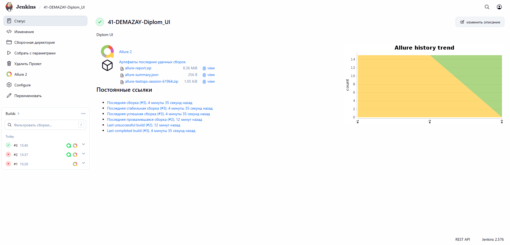
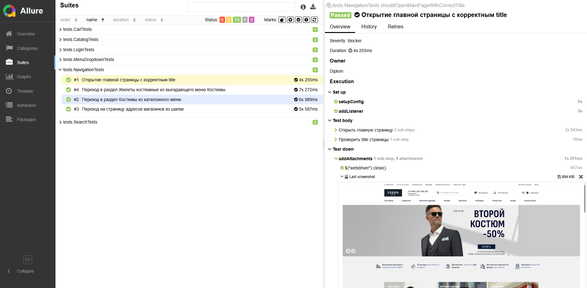
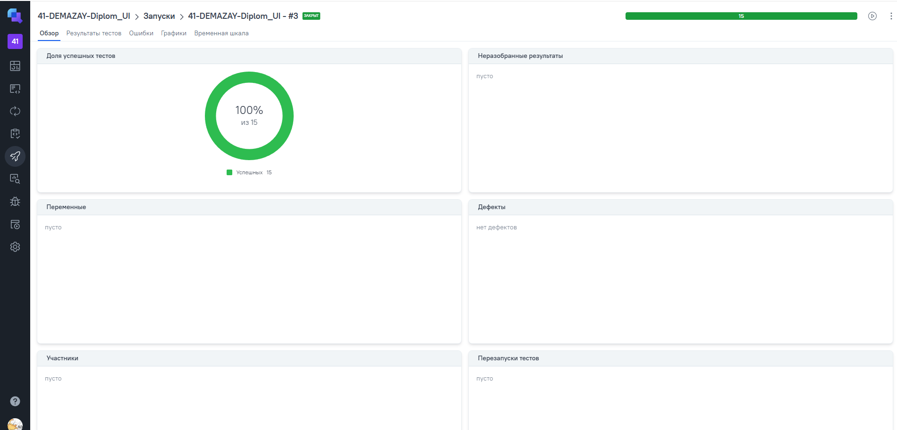
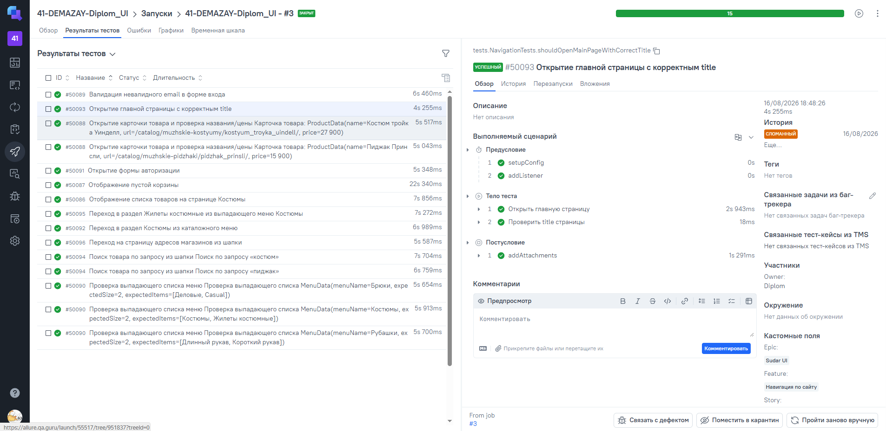
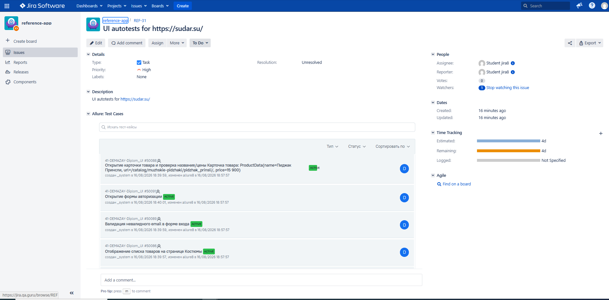
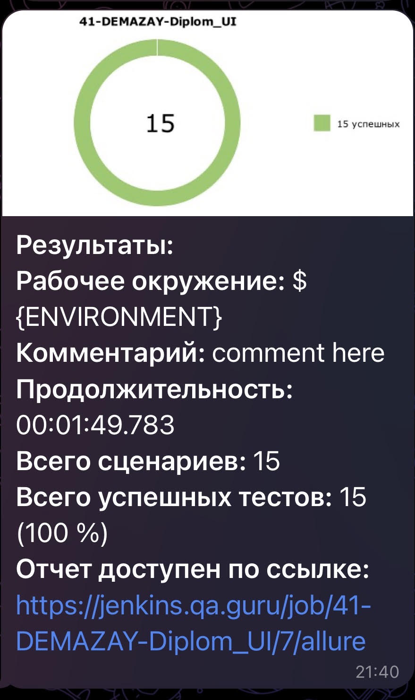

# Автоматизация тестирования сайта [СУДАРЬ](https://sudar.su/)

<p align="center">
  
</p>

## :scroll: Содержание:

- [Используемый стек](#computer-используемый-стек)
- [Запуск автотестов](#arrow_forward-запуск-автотестов)
- [Сборка в Jenkins](#сборка-в-jenkins)
- [Пример Allure-отчета](#пример-allure-отчета)
- [Видео прохождения теста](#видео-прохождения-теста)
- [Интеграция с Allure TestOps](#интеграция-с-allure-testops)
- [Интеграция с Jira](#интеграция-с-jira)
- [Уведомления в Telegram](#уведомления-в-telegram)

## :computer: Используемый стек

<p align="center">
<a href="https://www.jetbrains.com/idea/"></a>
<a href="https://www.java.com/"></a>
<a href="https://selenide.org/"></a>
<a href="https://aerokube.com/selenoid/"></a>
<a href="https://docs.qameta.io/allure/"></a>
<a href="https://qameta.io/"></a>
<a href="https://gradle.org/"></a>
<a href="https://junit.org/junit5/"></a>
<a href="https://github.com/"></a>
<a href="https://www.jenkins.io/"></a>
<a href="https://telegram.org/"></a>
<a href="https://www.atlassian.com/software/jira"></a>
</p>

Тесты написаны на [Java](https://www.java.com/) с использованием [Selenide](https://selenide.org/) и [Page Object](https://martinfowler.com/bliki/PageObject.html).  
Сборщик — [Gradle](https://gradle.org/), фреймворк — [JUnit 5](https://junit.org/junit5/).  
Модели данных — [Lombok](https://projectlombok.org/).  
Удалённый запуск — [Jenkins](https://www.jenkins.io/) + [Selenoid](https://aerokube.com/selenoid/), отчёты — [Allure Report](https://docs.qameta.io/allure/).  
Уведомления — [Telegram](https://telegram.org/). Интеграции — [Allure TestOps](https://qameta.io/), [Jira](https://www.atlassian.com/software/jira).

### Покрытый функционал
- Навигация: title главной, переходы Костюмы / Жилеты костюмные / Магазины
- Выпадающие меню Костюмы / Брюки / Рубашки
- Каталог «Костюмы»: список товаров, карточки (название/цена)
- Поиск по каталогу
- Форма авторизации (открытие и валидация)
- Пустая корзина
- Ручные тест-кейсы: заказ, мобильное меню, возврат

Содержание Allure-отчета:
* Шаги теста;
* Скриншот страницы на последнем шаге;
* Page Source;
* Логи браузерной консоли;
* Видео прохождения теста (Selenoid).

## :arrow_forward: Запуск автотестов

### Локальный запуск:
```
gradle clean test
```
### Удалённый запуск через Jenkins:
```
clean test
-Dbrowser=$BROWSER
-DbrowserVersion=$BROWSER_VERSION
-DbrowserSize=$BROWSER_SIZE
-DbaseUrl=$BASE_URL
-DremoteUrl=$REMOTE_URL
-Dheadless=$HEADLESS
```

Флаг `-DremoteUrl` передаётся в `Configuration.remote`, поэтому при запуске из Jenkins тесты идут в Selenoid, а не в локальный браузер.

<a id="сборка-в-jenkins"></a>

##  [Сборка в Jenkins](https://jenkins.qa.guru/job/41-DEMAZAY-Diplom_UI/)

Для запуска сборки необходимо перейти в раздел <code>Собрать с параметрами</code>, при необходимости указать <code>REMOTE_URL</code> хаба Selenoid и нажать кнопку <code>Собрать</code>.
<p align="center">

</p>
После выполнения сборки, в блоке <code>История сборок</code> напротив номера сборки появятся значки <code>Allure Report</code> и <code>Allure TestOps</code>, при клике на которые откроется страница с сформированным html-отчетом и тестовой документацией соответственно.

<a id="пример-allure-отчета"></a>

##  [Пример Allure-отчета](https://jenkins.qa.guru/job/41-DEMAZAY-Diplom_UI/3/allure/#)

### Overview

<p align="center">

</p>

В отчёте тесты сгруппированы по `@Epic` / `@Feature` / `@Story`.  
У каждого сценария есть `@DisplayName`, `@Owner` и `@Severity`.

<a id="видео-прохождения-теста"></a>

## :film_projector: Видео прохождения теста

Сценарий `shouldShowEmptyCartTest`: открытие главной → переход в корзину из шапки → проверка текста пустой корзины.

<p align="center">
  
</p>

При запуске в Selenoid видео каждого теста также прикладывается к Allure-отчёту (`enableVideo` + `Attach.addVideo()`).

<a id="интеграция-с-allure-testops"></a>

##  <a href="https://allure.qa.guru/project/5345/dashboards">Интеграция с Allure TestOps</a>

На *Dashboard* в <code>Allure TestOps</code> видна статистика количества тестов: сколько из них добавлены и проходятся вручную, сколько автоматизированы. Новые тесты, а так же результаты прогона приходят по интеграции при каждом запуске сборки.

Чтобы запускать тесты **из Allure TestOps** (кнопка Run у кейса или Launch), нужна двусторонняя интеграция с Jenkins:

1. В Jenkins установлен [Allure TestOps plugin](https://docs.qameta.io/reference/integrations/ci-systems/jenkins/), в *Manage Jenkins → System* указан сервер Allure. `serverId` в `Jenkinsfile` должен совпадать с ID этого сервера.
2. Job [`41-DEMAZAY-Diplom_UI`](https://jenkins.qa.guru/job/41-DEMAZAY-Diplom_UI/) — Pipeline from SCM по `Jenkinsfile` (шаг `withAllureUpload` грузит `build/allure-results` в проект `5345`). Если job остаётся Freestyle, добавьте wrapper **Allure: upload results** с тем же путём и project id.
3. В Allure TestOps: *Project → Settings → Integrations → Jenkins* — добавить этот job и включить **Job can be used to run tests**.

После этого в Test cases / Launches появляется запуск выбранных автотестов, а результаты прогона сразу видны в TestOps.

<p align="center">

</p>

### Результат выполнения автотеста

<p align="center">

</p>

<a id="интеграция-с-jira"></a>

##  <a href="https://jira.qa.guru/browse/REF-31">Интеграция с Jira</a>

Реализована интеграция <code>Allure TestOps</code> с <code>Jira</code>, в тикете отображается, какие тест-кейсы были написаны в рамках задачи и результат их прогона.

<p align="center">

</p>

<a id="уведомления-в-telegram"></a>

###  Уведомления в Telegram с использованием бота

После завершения сборки специальный бот, созданный в <code>Telegram</code>, автоматически обрабатывает и отправляет сообщение с отчетом о прогоне тестов.

<p align="center">

</p>
